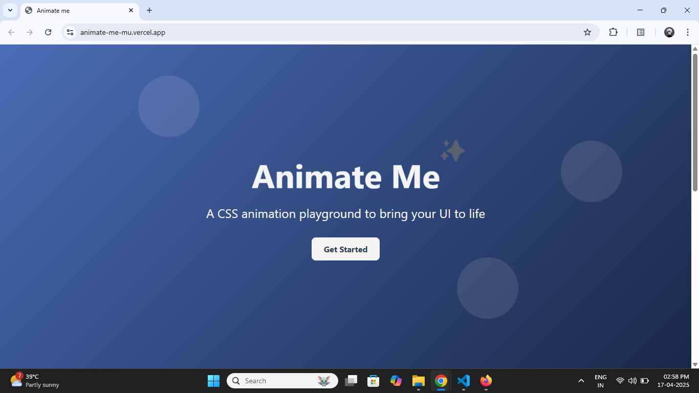
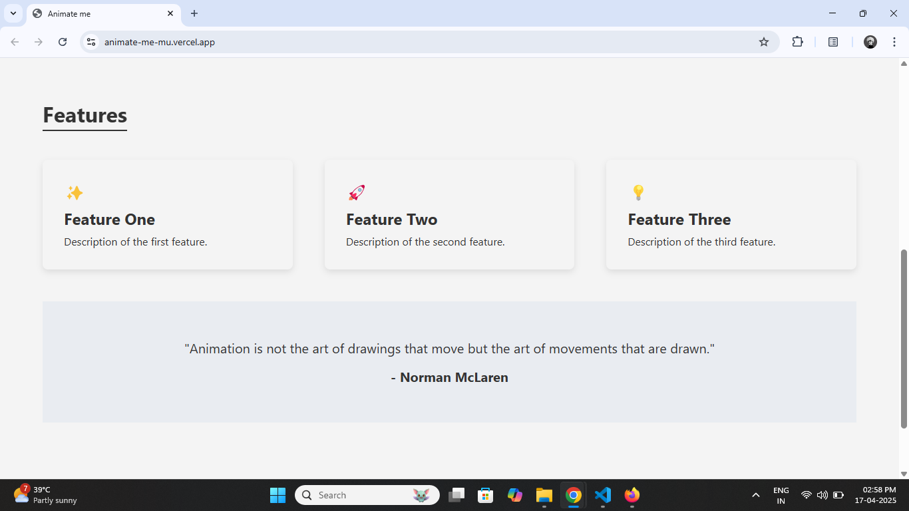
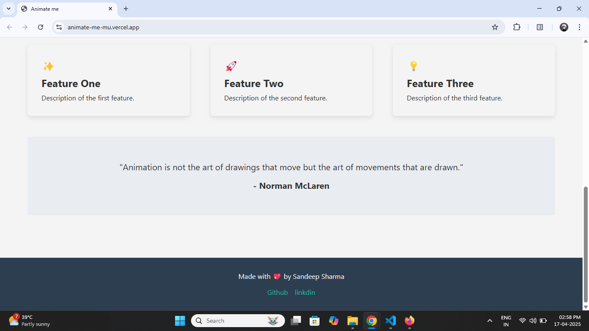

# Animate Me

This was a fun project where I learned about CSS animations.

## Learnings

### 1. 🔄 Transitions

Transitions allow you to smoothly change between two states when interacting with elements, like **hovering** or **focusing**. 

Key properties for transitions include :-

* transition-property:-  Specifies the CSS property that will change (e.g., transform, background-color).

* transition-duration:-  Defines how long the transition lasts (e.g., 0.3s).

* transition-timing-function:-  Specifies the speed curve of the transition (e.g., ease, linear, ease-in-out).

* transition-delay:-  Adds a delay before the transition starts (e.g., 0.5s).

**Example:**

```css
.btn {
  transition: transform 0.3s ease-in-out, box-shadow 0.3s ease-in-out;
}

.btn:hover {
  transform: scale(1.1); /* Scale the button on hover */
  box-shadow: 0 0 15px rgba(0, 0, 0, 0.3); /* Add a glow effect */
}
```

Here, the button smoothly grows and gains a glowing effect on hover, thanks to the transition-duration and timing-function.

### 2. 🎬 Keyframe Animations

With **@keyframes**, we can define custom animations. These animations can have different start and end states, or even intermediate steps.

Key properties for keyframes :-

* animation-name :- The name of the animation.

* animation-duration :-  How long the animation lasts (e.g., 2s).

* animation-timing-function :-  Controls the pace of the animation (e.g., linear, ease-in).

* animation-delay :-  Sets a delay before the animation starts.

* animation-iteration-count :-  How many times the animation should repeat (e.g., infinite).

* animation-direction :-  Specifies whether the animation should alternate or play in reverse.

**Example:**

```css
@keyframes fadeIn {
  0% { opacity: 0; }
  100% { opacity: 1; }
}

.fade-in-element {
  animation: fadeIn 2s ease-in-out;
}
```
In this example, the element fades in when the fadeIn animation is applied. The animation-duration of 2s specifies the transition time, and ease-in-out controls the fade-in effect.

### 3. 🔄 Transforms

**Transforms** allow you to visually manipulate elements. You can move, resize, rotate, and more without affecting the layout of your page.

Common transform properties :-

* transform :-  translate(x, y): Moves the element along the X and Y axes.

* transform :-  scale(x, y): Resizes the element along the X and Y axes.

* transform :-  rotate(deg): Rotates the element by the specified degree.

These properties can be combined with transitions for smooth animations.

**Example:**

```css
.card {
  transition: transform 0.3s ease;
}

.card:hover {
  transform: translateY(-10px); /* Moves the card slightly up on hover */
}
```

Here, when you hover over the card, it gently moves upwards due to the transition-duration and transform properties.

## Preview


